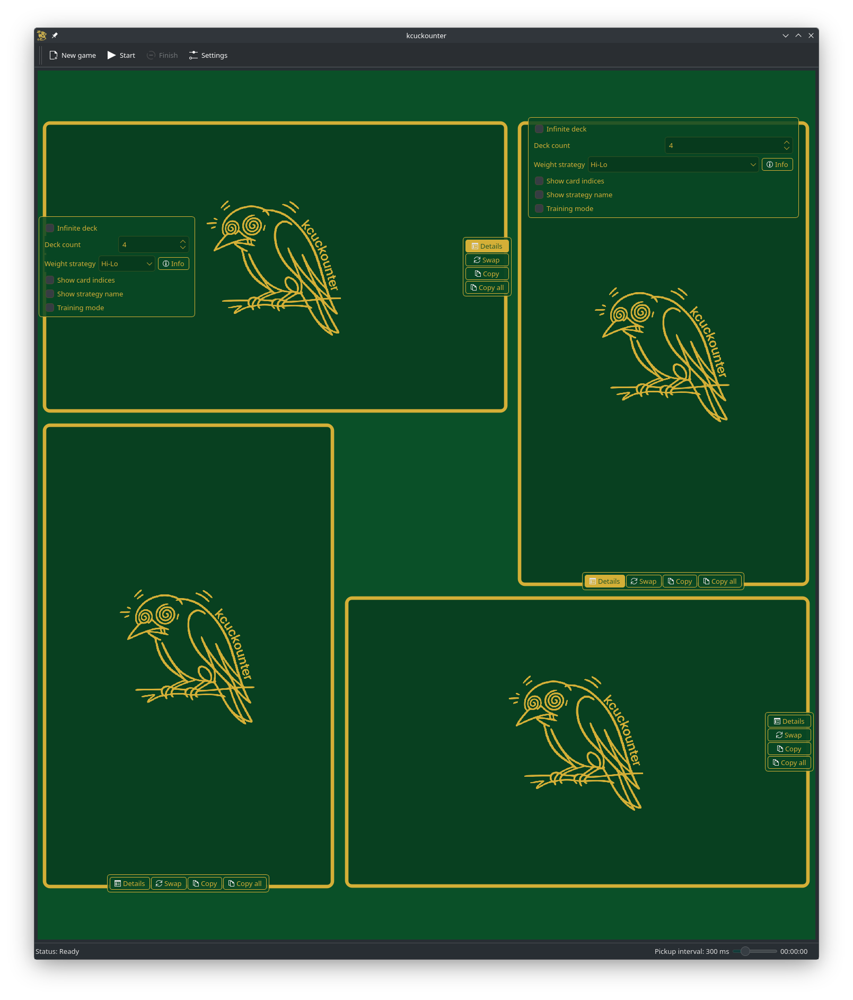
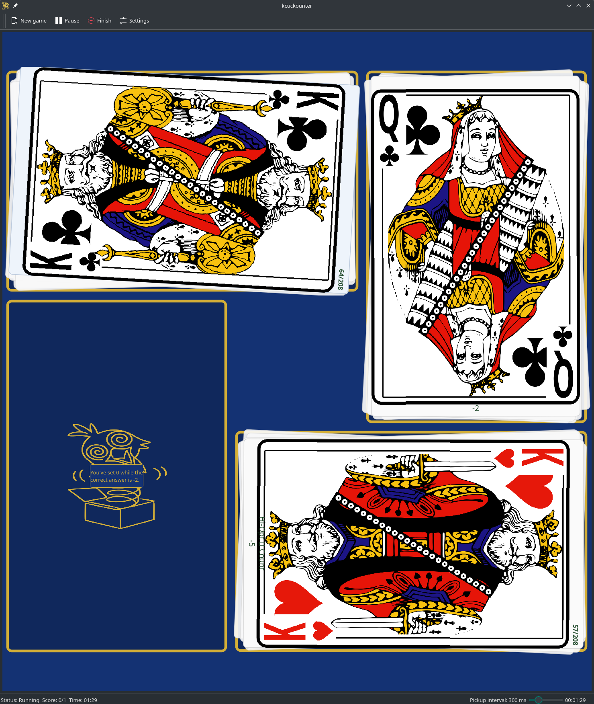
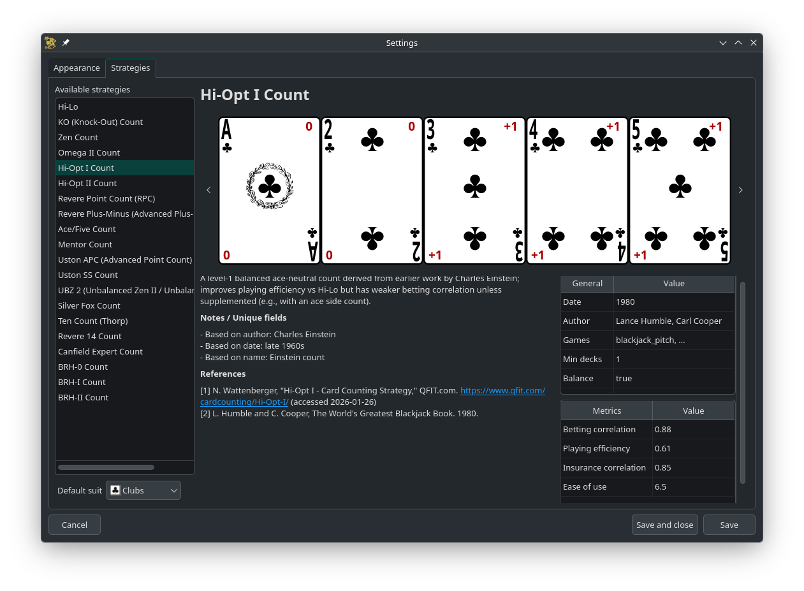

 i don't remember the first
table right, maybe not even cards, maybe roulette, that checkered nervous thing with little squares all fussing and
scattering and coming back for coins and chips while the ball keeps its small hard cycle, round and round, and outside
maybe day was moving on but in there it was another kind of turn, another return, and i was inside under the casino
light while outside the river was waiting, that i remember, the river better than the table, strange but true, the river
so close i can still reach toward it from the cut corner of memory, and the sky taking on the river's soft blue in that
sharp blinding light, and i still can't remember the table color, blue maybe, green maybe, maybe just wrong light on
cloth, while rare sailboat clouds held their stubborn levitating place and slowly cut through against the wind i wanted
so much, and me trying to blow all the chips off the cloth like dandelion seeds i was somehow obliged to scatter, not
because i wanted to multiply my chips or the weeds, no, just because i hated their pale dry fadedness, that old withered
look,  same as the dandelion
outside that for some reason got a fountain-monument, absurd little couture for a weed, and no smell from it, no smell
from the chips, nothing there for me except the urge to break the arrangement, to knock it loose, and since my mother
stopped working in the casino i think i never really met that table again, not that one, only television copies and card
games and stories and echoes, all weaker, all aftertaste, and still those seeds keep trying to reach me, encore, and i
still don't know how to say the cloth right because soft is not enough and felt is not enough, kid skin touches it and
the cloth takes you under, tucks you in, you sink wrists-first and cheek-first, and i did go looking after, carpets,
books on carpets, knees in carpets, face in seams, rubbing against them, working every corner, searching like Castaneda
for a place of power, that first serious search, while don Juan laughed and everybody laughed because there was always
somebody around, always there before you, They're out there. Black Kings and Red Queens in suits - up before me, to be
committed to the repository and get mopped up before you can
 memorize them. and
i tried, i really tried, not faces, not people, the table, the spread, the way the cards break and go and refuse to
stay, but they all fly off anyway, ...one flew east, one flew west, one flew over the multiple decks. all good things
end, yes, rooms close, lights change, you keep going, Just play poker in Indian Casinos and stay single and live where
and how he wants to, if people would let him, P.R. said - but Chief released him. and i'm not sure i can do that, i get
stuck, i am stuck, pulling myself through a bog of memory shards, and people are wrong when they say every shard only
cuts and hurts and must be thrown away, because some shards cut and some shards reflect and in some of them you can see
yourself and go back for one second to the sky carrying the river's blue, to the warm cloth, to the cards scattering
from you in all directions, and in that second the heart stops trying to leap out and just does its work, honest, and
maybe that is my work too, just gather the cards and lay them out, even if i cannot
 fully
hand over that table from memory, because who said the table is one thing for everyone, table is a screen, a curtain
while you wait for the next card, table is a jazz group, each one in slot and place and rhythm, and nobody has to live
by one pattern only, here a card opens long across the cloth like a trombone slide, there one lands exact as a
metronome, another cracks like a knout, and you cannot know what comes next, not really, but when the card opens you
know it is the one that had to be there, even if you begged for another, even if you kept saying once it has to go my
way, and you can try to tame it, cheat it, ask George Shearing for You Can't Put Your Arms Round a Memory, you can learn
Hi-Lo and KO (Knock-Out) Count and BRH-II Count and all the rest, but do you really want to know or do you want the
haze, the smoke before the turn, and can any of that be carried into C++ with Qt6, KF6, KDEGames6, coreaddons, ki18n,
kxmlgui, kconfigwidgets, kwidgetsaddons, kio, libkdegames, extra-cmake-modules, all of it correct, all of it working,
and still not the same, do you think it came through.

